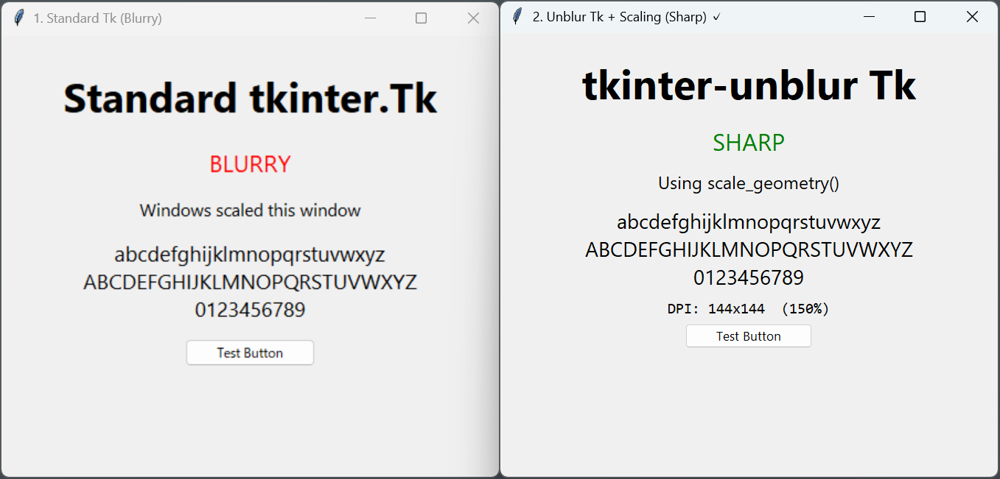

# tkinter-unblur

[](https://pypi.org/project/tkinter-unblur/)
[](https://pepy.tech/project/tkinter-unblur)
[](https://pypi.org/project/tkinter-unblur/)
[](https://mypy-lang.org/)
[](https://github.com/unlibra/tkinter-unblur/actions)
[](https://github.com/unlibra/tkinter-unblur/blob/master/LICENSE)

> **Note:** `hdpitkinter` has been reborn as `tkinter-unblur` with modern features. See [migration guide](#migrating-from-hdpitkinter).

**Fix blurry Tkinter applications on Windows 10/11 high-DPI displays.**

## The Problem

Tkinter applications look blurry and pixelated on modern high-resolution displays with scaling enabled (125%, 150%, 200%, etc.). This is because Tkinter is not DPI-aware by default on Windows.

## The Solution

```python
# Before (blurry)
from tkinter import Tk

# After (crystal clear)
from tkinter_unblur import Tk
```

That's it. One import change, and your Tkinter app renders sharply.

### Visual Comparison



**Left:** Standard Tkinter (blurry) | **Right:** tkinter-unblur (sharp)

## Installation

```bash
pip install tkinter-unblur
```

## Usage

```python
from tkinter_unblur import Tk

root = Tk()
root.title("My App")
root.geometry("800x600")
root.mainloop()
```

That's all you need! For advanced usage, see [API Reference](#api-reference).

## API Reference

### `Tk` Class

A drop-in replacement for `tkinter.Tk` with DPI awareness.

#### Attributes

- `dpi_x: int | None` - Horizontal DPI (96 = 100% scaling)
- `dpi_y: int | None` - Vertical DPI (96 = 100% scaling)
- `dpi_scaling: float` - Scaling factor (1.0 = 100%, 1.5 = 150%)

**Example:**

```python
root = Tk()
print(f"DPI: {root.dpi_x}x{root.dpi_y}")
print(f"Scaling: {root.dpi_scaling:.0%}")  # e.g., "Scaling: 150%"
```

#### Methods

##### `scale_value(value: int) -> int`

Scale a numeric value by the DPI factor.

**Example:**

```python
from tkinter import Label

root = Tk()
# Scale font size to maintain physical size across different DPI settings
label = Label(root, text="Hello", font=("Arial", root.scale_value(12)))
```

##### `scale_geometry(geometry: str) -> str`

Scale a geometry string ("WxH+X+Y") by the DPI factor.

**Example:**

```python
root = Tk()
# Scale window geometry (width x height + x + y)
root.geometry(root.scale_geometry("800x600+100+50"))
```

### Exceptions

- `TkinterUnblurError` - Base exception
- `UnsupportedPlatformError` - Platform doesn't support DPI awareness
- `DPIDetectionError` - DPI detection failed

## How It Works

On Windows, this library:

1. Calls `SetProcessDpiAwareness(1)` to enable system DPI awareness
2. Queries the monitor's DPI using `GetDpiForMonitor`
3. Provides scaling utilities for your application

On non-Windows platforms, the library is a simple passthrough to `tkinter.Tk`.

The implementation is based on [this Stack Overflow answer](https://stackoverflow.com/questions/41315873/attempting-to-resolve-blurred-tkinter-text-scaling-on-windows-10-high-dpi-disp).

## Compatibility

| Platform | Status |
|----------|--------|
| Windows 10/11 | Full DPI awareness support |
| Linux | Passthrough (OS handles DPI) |
| macOS | Passthrough (OS handles DPI) |

| Python Version | Status |
|----------------|--------|
| 3.9+ | Supported |
| 3.8 | Not supported (EOL) |

## Migrating from hdpitkinter

This package was formerly known as `hdpitkinter`. To migrate:

```bash
pip uninstall hdpitkinter
pip install tkinter-unblur
```

```python
# Old
from hdpitkinter import HdpiTk
root = HdpiTk()

# New
from tkinter_unblur import Tk
root = Tk()
```

The `HdpiTk` name is still available as an alias for backwards compatibility:

```python
from tkinter_unblur import HdpiTk  # Works, but Tk is preferred
```

## License

MIT License - see [LICENSE](LICENSE) for details.
